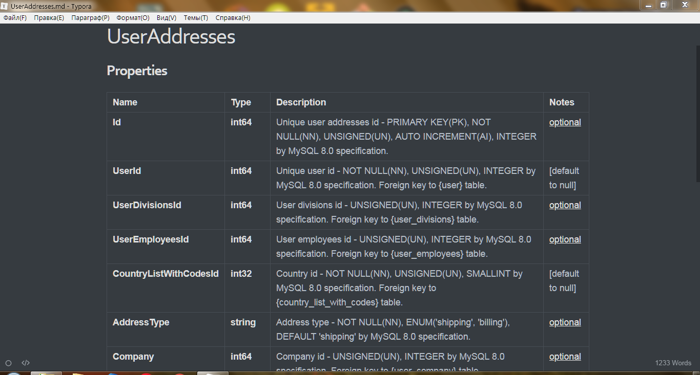

1. **Fully ready, working database with all the relationships:**

2. **Ready and working server architecture:**

3. **Partially described in the Swagger API:**

4. **Well documented code:**

5. **Generated, but good API documentation:**

