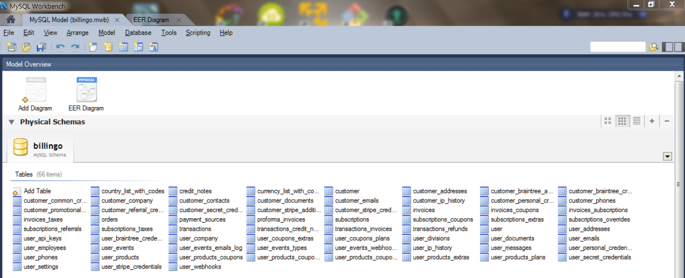
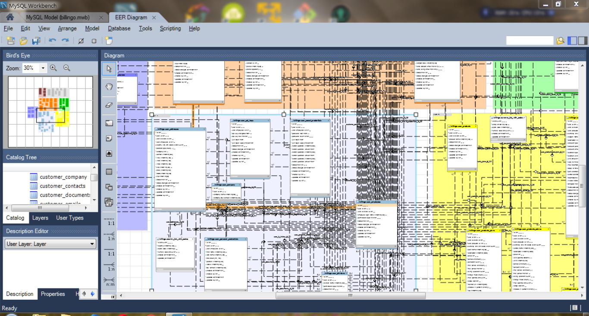
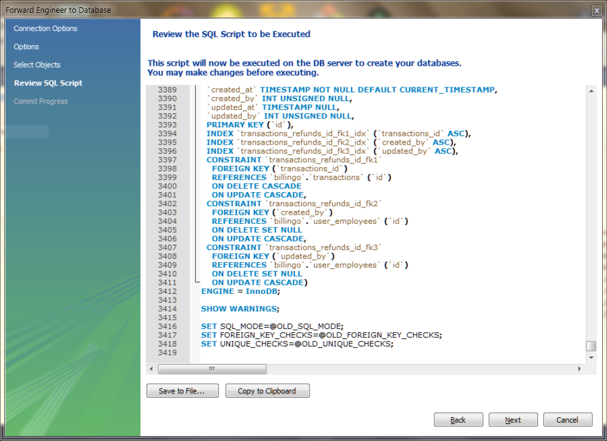
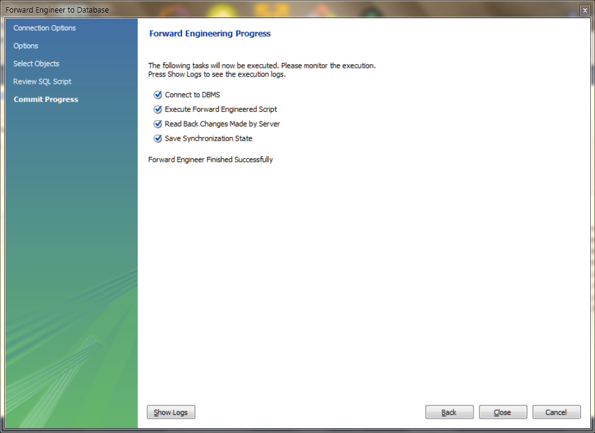
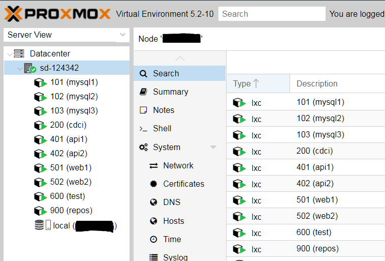
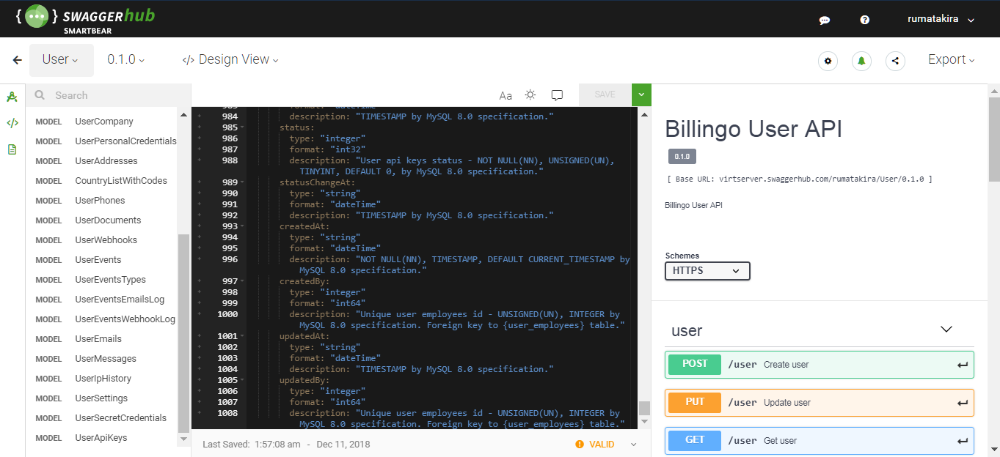

1. Полностью сверстанная, рабочая база данных со всеми взаимосвязями:

2. Собранная рабочая архитектура сервера:

3. Частично описанный в Swagger API:

4. Хорошо документированный код:

5. Генерируемая, но вменяемая документация по API:

